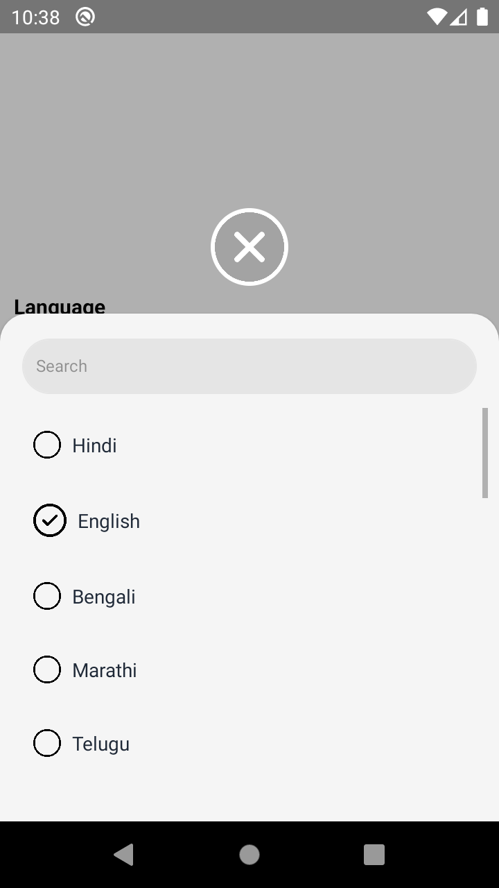
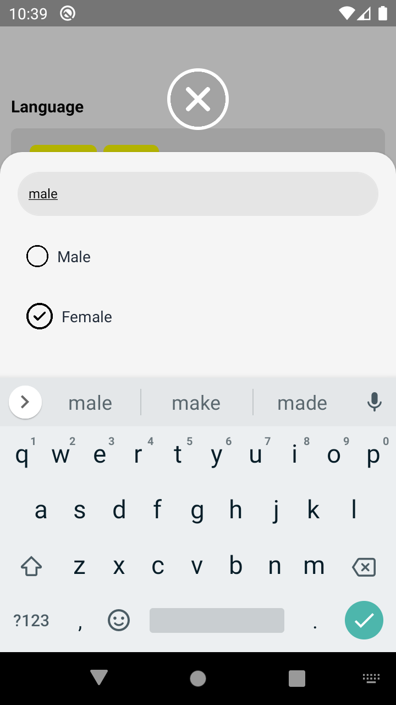

# Native Base Select 🔽

[](https://www.npmjs.com/package/@blump-tech/native-base-select)
[](https://www.npmjs.com/package/@blump-tech/native-base-select)
[](https://www.npmjs.com/package/@blump-tech/native-base-select)
[](https://github.com/Blump-Tech-Pvt-Ltd/native-base-select)
[](https://www.typescriptlang.org/)
[](https://reactnative.dev/)

- This module includes a customizable multi-select and a single select component for **Native Base**.
- The package is both **Android** and **iOS** compatible.
- The package is well-typed and supports **TypeScript**.
- Smooth and fast cross platform
- Type-safe

**Give us a GitHub star 🌟, if you found this package useful.**
[](https://GitHub.com/Blump-Tech-Pvt-Ltd/native-base-select)

[Native Base Select (NPM Link)](https://www.npmjs.com/package/@blump-tech/native-base-select)

## Would you like to support me?

<a href="https://www.buymeacoffee.com/pixmita"></a>

## Demo/Screenshots

<p float="left">

  
  
  
</p>

## Dependencies

```bash
native-base
react-native-safe-area-context
react-native-svg
```

## Installation

```bash
npm install @blump-tech/native-base-select
```

or

```bash
yarn add @blump-tech/native-base-select
```

## Basic Usage (Multi-Select)

```js
import { BTMultiSelect } from '@blump-tech/native-base-select';

// ...

const [language, setLanguage] = React.useState({
  value: '',
  list: [
    { _id: 1, name: 'Hindi' },
    { _id: 2, name: 'English' },
    { _id: 3, name: 'Bengali' },
    { _id: 4, name: 'Marathi' },
    { _id: 5, name: 'Telugu' },
    { _id: 6, name: 'Tamil' },
    { _id: 7, name: 'Gujarati' },
    { _id: 8, name: 'Urdu' },
    { _id: 9, name: 'Kannada' },
    { _id: 10, name: 'Odia' },
    { _id: 11, name: 'Malayalam' },
    { _id: 12, name: 'Punjabi' },
    { _id: 13, name: 'Assamese' },
    { _id: 14, name: 'Maithili' },
    { _id: 15, name: 'Sanskrit' },
    { _id: 16, name: 'Nepali' },
    { _id: 17, name: 'Dzongkha' },
    { _id: 18, name: 'Bhojpuri' },
    { _id: 19, name: 'Tibetan' },
    { _id: 20, name: 'Sinhalese' },
    { _id: 21, name: 'Khasi' },
  ],
  selectedList: [],
  error: '',
});

<BTMultiSelect
  label="Language"
  placeholder="Select at least 2 Language"
  list={language.list}
  selectedList={language.selectedList}
  onSelection={(value: any) => {
    setLanguage({
      ...language,
      value: value.text,
      selectedList: value.selectedList,
      error: '',
    });
  }}
  errorText={language.error}
  pillStyle={{ backgroundColor: 'yellow' }}
  errorStyle={{ textColor: 'red' }}
/>;
```

## Basic Usage (Single-Select)

```js
import { BTSingleSelect } from '@blump-tech/native-base-select';

// ...

<BTSingleSelect
  label="Gender"
  placeholder="Select your gender"
  list={gender.list}
  selectedList={gender.selectedList}
  onSelection={(value: any) => {
    setGender({
      ...gender,
      value: value.text,
      selectedList: value.selectedList,
      error: '',
    });
  }}
  errorText={gender.error}
  pillStyle={{ backgroundColor: 'yellow' }}
  errorStyle={{ textColor: 'red' }}
/>;
```

### Props

| props                      | type                                                                                                                                                                                        | description                                                                                                       | default value                                                                              | required |
| -------------------------- | ------------------------------------------------------------------------------------------------------------------------------------------------------------------------------------------- | ----------------------------------------------------------------------------------------------------------------- | ------------------------------------------------------------------------------------------ | -------- |
| label                      | string                                                                                                                                                                                      | label of the input                                                                                                | set to empty string if you don’t want to display                                           | yes      |
| list                       | Array<{\_id: string, name: string}>                                                                                                                                                         | Array of items.Should be an array of objects with \_id and name property.example: \[{"\_id": 1, "name": "Red"}\]. | there isn't any default value you need to specify a list.                                  | yes      |
| selectedList               | Array<{\_id: string, name: string}>                                                                                                                                                         | selected elements or preselected elements                                                                         | set empty array as default                                                                 | yes      |
| placeholder                | string                                                                                                                                                                                      | placeholder field                                                                                                 | set to empty string if you don’t want to display                                           | yes      |
| selectInputStyle           | {paddingHorizontal?: number; paddingVertical?: number; backgroundColor?: ViewStyle\['backgroundColor'\]; borderRadius?: number;  }                                                          | style of the input                                                                                                | {paddingHorizontal: 14, paddingVertical: 12, backgroundColor: '#e5e5e5', borderRadius:  6} | no       |
| pillStyle                  | { backgroundColor?: ViewStyle\['backgroundColor'\]; textColor?: TextStyle\['color'\];  fontSize?: TextStyle\['fontSize'\]; fontWeight?: TextStyle\['fontWeight'\]; borderRadius?: number; } | style of the pill                                                                                                 | {fontSize: 14, backgroundColor: 'silver', color:  '#000', borderRadius: 6}                 | no       |
| placeHolderStyle           | { textColor?: TextStyle\['color'\]; fontSize?: TextStyle\['fontSize'\]; fontWeight?:TextStyle\['fontWeight'\];}                                                                             | style of the placeholder                                                                                          | {color: 'gray', fontSize:12,fontWeight: '400'}                                             | no       |
| labelStyle                 | { textColor?: TextStyle\['color'\]; fontSize?: TextStyle\['fontSize'\]; fontWeight?:TextStyle\['fontWeight'\]; }                                                                            | style of the label                                                                                                | {fontWeight: '700', fontSize: 15,color:'#000'}                                             | no       |
| errorStyle                 | { textColor?: TextStyle\['color'\]; fontSize?: TextStyle\['fontSize'\];  fontWeight?: TextStyle\['fontWeight'\]; }                                                                          | style of error text                                                                                               | {fontWeight:'500', fontSize:12, color:'red'}                                               | no       |
| errorText                  | string                                                                                                                                                                                      | text to display on error                                                                                          | set to empty string as default                                                             | yes      |
| listTextStyle              | default react native text style                                                                                                                                                             | style of the text in list                                                                                         | default react native text style                                                            | no       |
| actionSheetBackgroundColor | ViewStyle\['backgroundColor'\]                                                                                                                                                              | background of action sheet                                                                                        | #f5f5f5                                                                                    | no       |
| searchStyle                | {  backgroundColor?: ViewStyle\['backgroundColor'\];textColor?: TextStyle\['color'\];  borderRadius?: number; borderColor: ViewStyle\['borderColor'\];}                                     | search bar style                                                                                                  | {borderRadius: 20, borderColor: '#e5e5e5', backgroundColor: '#e5e5e5', color:  '#000'}     | no       |

### Callback Methods

- `onSelection` - Return the selected item when an item is selected.
  Example :

  ```ts
  onSelection={(value: any) => {
    setLanguage({
      ...language,
      value: value.text,
      selectedList: value.selectedList,
      error: '',
    });
  }}
  ```

## Example

```ts
import * as React from 'react';

import { StyleSheet, View, TouchableOpacity, Text } from 'react-native';
import { BTSingleSelect, BTMultiSelect } from '@blump-tech/native-base-select';

export default function App() {
  const [successText, setSuccessText] = React.useState('');
  const [language, setLanguage] = React.useState({
    value: '',
    list: [
      { _id: '1', name: 'Hindi' },
      { _id: '2', name: 'English' },
      { _id: '3', name: 'Bengali' },
      { _id: '4', name: 'Marathi' },
      { _id: '5', name: 'Telugu' },
      { _id: '6', name: 'Tamil' },
      { _id: '7', name: 'Gujarati' },
      { _id: '8', name: 'Urdu' },
      { _id: '9', name: 'Kannada' },
      { _id: '10', name: 'Odia' },
      { _id: '11', name: 'Malayalam' },
      { _id: '12', name: 'Punjabi' },
      { _id: '13', name: 'Assamese' },
      { _id: '14', name: 'Maithili' },
      { _id: '15', name: 'Sanskrit' },
      { _id: '16', name: 'Nepali' },
      { _id: '17', name: 'Dzongkha' },
      { _id: '18', name: 'Bhojpuri' },
      { _id: '19', name: 'Tibetan' },
      { _id: '20', name: 'Sinhalese' },
      { _id: '21', name: 'Khasi' },
    ],
    selectedList: [],
    error: '',
  });
  const [gender, setGender] = React.useState({
    value: '',
    list: [
      { _id: 'Male', name: 'Male' },
      { _id: 'Female', name: 'Female' },
      { _id: 'Other', name: 'Other' },
    ],
    selectedList: [],
    error: '',
  });
  const _submit = () => {
    if (language.selectedList.length === 0) {
      setLanguage({ ...language, error: 'Please select language' });
      return;
    }
    if (gender.selectedList.length === 0) {
      setGender({ ...gender, error: 'Please select gender.' });
      return;
    }
    setSuccessText('Submitted......');
  };
  return (
    <View style={styles.container}>
      <BTMultiSelect
        label="Language"
        placeholder="Select at least 2 Language"
        list={language.list}
        selectedList={language.selectedList}
        onSelection={(value: any) => {
          setLanguage({
            ...language,
            value: value.text,
            selectedList: value.selectedList,
            error: '',
          });
        }}
        errorText={language.error}
        pillStyle={{ backgroundColor: 'yellow' }}
        errorStyle={{ textColor: 'red' }}
      />
      <BTSingleSelect
        label="Gender"
        placeholder="Select your gender"
        list={gender.list}
        selectedList={gender.selectedList}
        onSelection={(value: any) => {
          setGender({
            ...gender,
            value: value.text,
            selectedList: value.selectedList,
            error: '',
          });
        }}
        errorText={gender.error}
        pillStyle={{ backgroundColor: 'yellow' }}
        errorStyle={{ textColor: 'red' }}
      />
      <TouchableOpacity
        onPress={() => {
          _submit();
        }}
        style={{
          padding: 16,
          width: '100%',
          justifyContent: 'center',
          alignContent: 'center',
          alignItems: 'center',
          backgroundColor: 'green',
          borderRadius: 8,
          marginTop: 10,
        }}
      >
        <Text style={{ color: 'white', fontSize: 15, fontWeight: '600' }}>
          Submit
        </Text>
      </TouchableOpacity>
      <Text style={{ color: 'green', marginTop: 10 }}>{successText}</Text>
    </View>
  );
}

const styles = StyleSheet.create({
  container: {
    flex: 1,
    flexDirection: 'column',
    padding: 10,
    width: '100%',
    alignSelf: 'center',
    alignItems: 'center',
    justifyContent: 'center',
    flexGrow: 1,
  },
});
````

You can check the example source code in [example module](https://github.com/Blump-Tech-Pvt-Ltd/native-base-select/tree/main/example).

## Try it out

You can run the example module by performing these steps:

```
git clone https://github.com/Blump-Tech-Pvt-Ltd/native-base-select.git
cd native-base-select && cd example
npm install
cd ios && pod install && cd ..
react-native run-ios
react-native run-android
```

## Used By

- [Mohabbatein](https://www.mohabbatein.co/)

## Authors

- Anurag Srivastava [(@srivastavaanurag79)](https://github.com/srivastavaanurag79)
- Harshit Singhal [(@Harshit31)](https://github.com/Harshit31)

## Contributing

See the [contributing guide](CONTRIBUTING.md) to learn how to contribute to the repository and the development workflow.

## License

MIT
