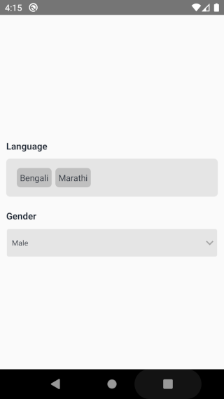

# native-base-select

Select creates a dropdown list of items with the selected item in closed view.

[ Native Base Select ](https://www.npmjs.com/package/@blump-tech/native-base-select)

## Dependencies

```bash
native-base
react-native-safe-area-context
react-native-svg
react-native-vector-icons
```

## Installation

```bash
npm install native-base-select
```

or

```bash
yarn add native-base-select
```

## Basic Usage (Multi-Select)

```js
import MultiSelectInput from 'native-base-select';

// ...

const [language, setLanguage] = React.useState({
  value: '',
  list: [
    { _id: 1, name: 'Hindi' },
    { _id: 2, name: 'English' },
    { _id: 3, name: 'Bengali' },
    { _id: 4, name: 'Marathi' },
    { _id: 5, name: 'Telugu' },
    { _id: 6, name: 'Tamil' },
    { _id: 7, name: 'Gujarati' },
    { _id: 8, name: 'Urdu' },
    { _id: 9, name: 'Kannada' },
    { _id: 10, name: 'Odia' },
    { _id: 11, name: 'Malayalam' },
    { _id: 12, name: 'Punjabi' },
    { _id: 13, name: 'Assamese' },
    { _id: 14, name: 'Maithili' },
    { _id: 15, name: 'Sanskrit' },
    { _id: 16, name: 'Nepali' },
    { _id: 17, name: 'Dzongkha' },
    { _id: 18, name: 'Bhojpuri' },
    { _id: 19, name: 'Tibetan' },
    { _id: 20, name: 'Sinhalese' },
    { _id: 21, name: 'Khasi' },
  ],
  selectedList: [],
  error: '',
});

<MultiSelectInput
  label="Language"
  placeholder="Select at least 2 Language"
  value={language.value}
  list={language.list}
  selectedList={language.selectedList}
  onSelection={(value: any) => {
    setLanguage({
      ...language,
      value: value.text,
      selectedList: value.selectedList,
      error: '',
    });
  }}
  errorText={language.error}
/>;
```

## Basic Usage (Single-Select)

```js
import SelectInput from 'native-base-select';

// ...

<SelectInput
  label="Gender"
  placeholder="Gender"
  list={[
    { label: 'Male', value: 'male' },
    { label: 'Female', value: 'female' },
    { label: 'Other', value: 'other' },
  ]}
  selectedValue={gender.value}
  onValueChange={(val: any) => {
    setGender({ value: val, error: '' });
  }}
/>;
```

### Props

| Setting           | Type                                 | Description                                                                                                                                  | Default Value |
| :---------------- | :----------------------------------- | :------------------------------------------------------------------------------------------------------------------------------------------- | :------------ |
| label             | string                               | select input label                                                                                                                           |               |
| list         | Array<{\_id: string, name: string}> | Array of items from which to select. Should be an array of objects with `_id` and `name` properties. example: [{"_id": 1, "name": "Red"}]. |               |
| selectedList | Array<{\_id: string, name: string}> | selected elements from dropdown                                                                                                              |               |
| errorText         | String                               | text you want to show in case of error                                                                                                       |               |
| value             | String                               | default text value to be shown in the field                                                                                                  |               |
| placeholder             | String                               |placeholder field                                                                                                  |               |
| selectedValue (single Select)             | String                               |default value for single select                                                                                                  |               |
### Callback Methods

- `onSelection` - Return the selected item when an item is selected.
  Example : (onSelect)="onItemSelect($event)"

## Example

```js
import * as React from 'react';

import { StyleSheet, View } from 'react-native';
import MultiSelectInput from '../../src/components/multi-select/multi-select.component';
import SelectInput from '../../src/components/select/select.component';

export default function App() {
  const [language, setLanguage] = React.useState({
    value: '',
    list: [
      { _id: 1, name: 'Hindi' },
      { _id: 2, name: 'English' },
      { _id: 3, name: 'Bengali' },
      { _id: 4, name: 'Marathi' },
      { _id: 5, name: 'Telugu' },
      { _id: 6, name: 'Tamil' },
      { _id: 7, name: 'Gujarati' },
      { _id: 8, name: 'Urdu' },
      { _id: 9, name: 'Kannada' },
      { _id: 10, name: 'Odia' },
      { _id: 11, name: 'Malayalam' },
      { _id: 12, name: 'Punjabi' },
      { _id: 13, name: 'Assamese' },
      { _id: 14, name: 'Maithili' },
      { _id: 15, name: 'Sanskrit' },
      { _id: 16, name: 'Nepali' },
      { _id: 17, name: 'Dzongkha' },
      { _id: 18, name: 'Bhojpuri' },
      { _id: 19, name: 'Tibetan' },
      { _id: 20, name: 'Sinhalese' },
      { _id: 21, name: 'Khasi' },
    ],
    selectedList: [],
    error: '',
  });
  const [gender, setGender] = React.useState({ value: '', error: '' });
  return (
    <View style={styles.container}>
      <MultiSelectInput
        label="Language"
        placeholder="Select at least 2 Language"
        value={language.value}
        list={language.list}
        selectedList={language.selectedList}
        onSelection={(value: any) => {
          setLanguage({
            ...language,
            value: value.text,
            selectedList: value.selectedList,
            error: '',
          });
        }}
        errorText={language.error}
      />
      <SelectInput
        label="Gender"
        placeholder="Gender"
        list={[
          { label: 'Male', value: 'male' },
          { label: 'Female', value: 'female' },
          { label: 'Other', value: 'other' },
        ]}
        selectedValue={gender.value}
        onValueChange={(val: any) => {
          setGender({ value: val, error: '' });
        }}
      />
    </View>
  );
}

const styles = StyleSheet.create({
  container: {
    flex: 1,
    flexDirection: 'column',
    padding: 10,
    width: '100%',
    alignSelf: 'center',
    alignItems: 'center',
    justifyContent: 'center',
    flexGrow: 1,
  },
});
```

## Demo



## Used By

- [Mohabbatein](https://www.mohabbatein.co/)

## Authors

- Anurag Srivastava [(@srivastavaanurag79)](https://github.com/srivastavaanurag79)
- Harshit Singhal [(@Harshit31)](https://github.com/Harshit31)

## Contributing

See the [contributing guide](CONTRIBUTING.md) to learn how to contribute to the repository and the development workflow.

## License

MIT
